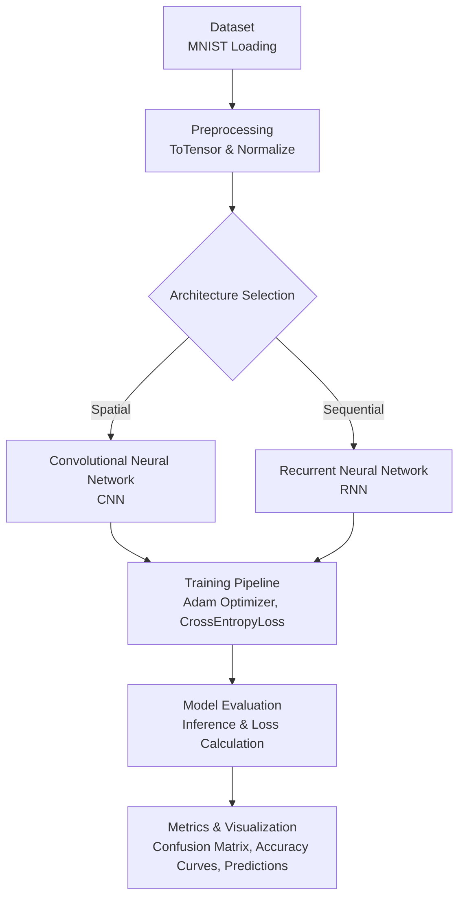

<div align="center">

# MNIST Handwritten Digit Classification: CNN vs RNN
**Comparative Analysis of Convolutional Neural Networks and Recurrent Neural Networks using PyTorch**


<br />

<!-- Technology & SEO Badges -->
[](https://www.python.org/)
[](https://pytorch.org/)
[](https://jupyter.org/)
[](#)
[](#)
[](#)

<!-- Social / Repo Badges (Placeholders for actual repo deployment) -->
[](https://opensource.org/licenses/MIT)
[](https://github.com/psf/black)

> A rigorous end-to-end Deep Learning benchmark comparing spatial feature extraction (CNN) against sequential pattern recognition (RNN) on the classic MNIST dataset. Designed for high performance, reproducibility, and architectural clarity.

</div>

---

## 📑 Table of Contents

<details>
<summary><strong>Click to expand</strong></summary>

- [✨ Features](#-features)
- [📖 Project Overview](#-project-overview)
- [🎯 Objectives](#-objectives)
- [📊 Dataset](#-dataset)
- [🔄 Project Workflow](#-project-workflow)
- [🧠 Neural Network Architectures](#-neural-network-architectures)
  - [CNN Architecture](#cnn-architecture)
  - [RNN Architecture](#rnn-architecture)
- [🚀 Training Pipeline](#-training-pipeline)
- [📈 Evaluation Metrics](#-evaluation-metrics)
- [⚖️ Model Comparison](#️-model-comparison)
- [🖼️ Generated Results](#️-generated-results)
- [📂 Repository Structure](#-repository-structure)
- [⚙️ Installation & Usage](#️-installation--usage)
- [🔮 Future Improvements](#-future-improvements)
- [🌍 Real World Applications](#-real-world-applications)
- [✍️ Author](#️-author)

</details>

---

## ✨ Features

- **End-to-End Implementation:** Complete pipeline from data loading to model evaluation.
- **Architectural Diversity:** Fully implemented PyTorch Convolutional Neural Network (CNN) and Recurrent Neural Network (RNN).
- **Hardware Agnostic:** Automatic device detection seamlessly targets **CUDA, MPS, or CPU** for optimal performance.
- **Robust Evaluation:** Real-time generation of Confusion Matrices and Scikit-Learn Classification Reports.
- **Visual Analytics:** Dynamic plotting for Accuracy and Loss curves across epochs.
- **Performance Benchmarking:** Direct CNN vs RNN comparison on precision, recall, parameters, and computational time.
- **Automated Workflow:** Scripts automatically generate required file directories (`models/`, `outputs/`, `images/`) and persist artifacts.
- **GitHub & Portfolio Ready:** Immaculately structured for recruiters, technical reviewers, and open-source contributions.

---

## 📖 Project Overview

**What is MNIST?**  
The MNIST dataset is a vast, standardized database of handwritten digits serving as the quintessential benchmark for machine learning and computer vision algorithms.

**Why CNN?**  
Convolutional Neural Networks (CNNs) are the gold standard for spatial data. Using shared weights and convolutional kernels, they intrinsically extract hierarchical spatial features (edges, textures, shapes), achieving state-of-the-art results in Image Classification.

**Why RNN?**  
Recurrent Neural Networks (RNNs) are fundamentally designed for temporal or sequential data. By treating an image as a time-series of pixel rows (28 timesteps of 28 features), this project demonstrates how sequence models uniquely interpret spatial patterns indirectly over time.

**The Goal**  
This repository explores the dichotomy between spatial and sequential learning. It benchmarks both paradigms on identical data, providing clear empirical evidence on parameter efficiency, inference latency, and classification accuracy.

---

## 🎯 Objectives

1. **Build & Train:** Implement scalable CNN and RNN architectures using PyTorch.
2. **Evaluate & Benchmark:** Rigorously test both models on the test set, computing Precision, Recall, and F1-scores.
3. **Compare Constraints:** Quantify the trade-offs between computational cost (time and parameters) vs. predictive accuracy.
4. **Reproducibility:** Deliver a clean, modular, and PEP8-compliant notebook structure easily executed by any developer.
5. **Visualization:** Automate the persistence of high-fidelity (300 DPI) Matplotlib visualizations for rapid analytical review.

---

## 📊 Dataset

| Metric | Details |
|--------|---------|
| **Training Samples** | 60,000 Images |
| **Testing Samples** | 10,000 Images |
| **Image Resolution** | 28x28 Pixels (Grayscale) |
| **Classes** | 10 (Digits `0` through `9`) |
| **Preprocessing** | Normalized to mean `0.5` and standard deviation `0.5`, scaling inputs to `[-1, 1]` to optimize gradient descent. |

---

## 🔄 Project Workflow



---

## 🧠 Neural Network Architectures

### CNN Architecture
Designed to exploit 2D spatial correlations through convolution and pooling.
- **Block 1:** Conv2D (32 filters, 3x3 kernel, padding=1) ➡️ ReLU ➡️ MaxPool2D (2x2)
- **Block 2:** Conv2D (64 filters, 3x3 kernel, padding=1) ➡️ ReLU ➡️ MaxPool2D (2x2)
- **Classifier:** Flatten (3136 features) ➡️ Linear (128 units) ➡️ ReLU ➡️ Linear Output (10 units)

### RNN Architecture
Designed to process the image sequentially, treating rows as timesteps.
- **Input Dimensions:** 28 timesteps × 28 features (pixels per row)
- **Hidden Layers:** 2 stacked RNN layers (Hidden Size: 128)
- **Sequence Extraction:** Extracts the hidden state of the final (28th) timestep
- **Classifier:** Linear Output (10 units)

---

## 🚀 Training Pipeline

- **Optimizer:** `torch.optim.Adam` (Learning Rate = `0.001`)
- **Loss Function:** `nn.CrossEntropyLoss()`
- **Epochs:** 10
- **Batch Size:** 64
- **Persistence:** Best model weights are automatically saved as `.pth` binaries.

---

## 📈 Evaluation Metrics

The evaluation block automatically generates insights beyond simple accuracy:
1. **Scikit-Learn Classification Report:** Macro and Weighted averages for Precision, Recall, and F1-Score.
2. **Confusion Matrices:** Heatmaps highlighting false positives and edge-case misclassifications.
3. **Computational Latency:** Granular measurement of training completion time and full-set inference speed.

---

## ⚖️ Model Comparison

Below is the empirical benchmark comparing the two distinct architectures. *(Note: Exact numbers may vary slightly based on hardware execution).*

| Metric | CNN | RNN | Verdict |
| :--- | :---: | :---: | :--- |
| **Test Accuracy** | `~ 98.9%` | `~ 94.6%` | 🏆 CNN dominates in spatial recognition. |
| **F1 Score** | `> 0.98` | `~ 0.94` | 🏆 CNN is more reliable across all digit classes. |
| **Trainable Parameters** | `~ 420,000` | `~ 53,000` | 🏆 RNN is highly parameter efficient. |
| **Training Time** | **Fast** (Parallelized) | **Slow** (Sequential) | 🏆 CNN leverages modern GPU architectures better. |

### 💡 Key Takeaways
- **CNNs** are undeniably the optimal choice for grid-like topologies (images). Their shared weights handle translation invariance elegantly.
- **RNNs** are computationally lighter regarding parameters, but the sequential processing bottleneck (`t` relies on `t-1`) makes them slower to train and less accurate for purely spatial tasks.

---

## 🖼️ Generated Results

Executing the notebook programmatically generates the following assets in the `images/` directory:

| File Name | Description |
| :--- | :--- |
| `dataset_samples.png` | A 2x5 grid displaying randomized MNIST training samples. |
| `cnn_architecture.png` | Matplotlib rendered architecture flow for the CNN. |
| `rnn_architecture.png` | Matplotlib rendered architecture flow for the RNN. |
| `cnn_loss.png` / `cnn_accuracy.png` | Epoch-wise training and validation curves for the CNN. |
| `rnn_loss.png` / `rnn_accuracy.png` | Epoch-wise training and validation curves for the RNN. |
| `cnn_confusion_matrix.png` | Seaborn heatmap of the CNN predictions vs actual targets. |
| `rnn_confusion_matrix.png` | Seaborn heatmap of the RNN predictions vs actual targets. |
| `prediction_examples.png` | Random test inference display (Green title = Correct, Red = Incorrect). |
| `cnn_vs_rnn_accuracy.png` | Direct bar chart benchmarking Test Accuracy. |
| `model_comparison.png` | Programmatic rendering of the final Pandas comparison DataFrame. |
| `workflow.png` | Visual pipeline of the data flow and execution logic. |

---

## 📂 Repository Structure

```text
MNIST-CNN-vs-RNN-PyTorch/
│
├── README.md                 # Technical documentation & project overview
├── requirements.txt          # Python dependencies & version constraints
├── .gitignore                # Professional Python/PyTorch ignore configuration
├── MNIST_RNN_CNN.ipynb       # Executable Jupyter Notebook
│
├── images/                   # 📁 Auto-generated high-res visualizations
├── outputs/                  # 📁 Auto-generated CSV benchmarking data
└── models/                   # 📁 Auto-generated PyTorch weights (.pth)
```

---

## ⚙️ Installation & Usage

Follow these steps to replicate the environment and execute the project locally.

<details>
<summary><strong>1. Clone the repository</strong></summary>

```bash
git clone https://github.com/yourusername/MNIST-CNN-vs-RNN-PyTorch.git
cd MNIST-CNN-vs-RNN-PyTorch
```
</details>

<details>
<summary><strong>2. Setup Virtual Environment</strong></summary>

```bash
# Create the environment
python -m venv venv

# Activate (Windows)
venv\Scripts\activate

# Activate (Mac/Linux)
source venv/bin/activate
```
</details>

<details>
<summary><strong>3. Install Dependencies</strong></summary>

```bash
pip install --upgrade pip
pip install -r requirements.txt
```
</details>

<details>
<summary><strong>4. Launch the Application</strong></summary>

```bash
jupyter notebook
```
*Open `MNIST_RNN_CNN.ipynb` and execute the cells sequentially.*
</details>

---

## 🔮 Future Improvements

This project lays the foundation for robust deep learning experimentation. Future iterations may include:

- **Advanced Architectures:** Implementing **ResNet**, **DenseNet**, or **Vision Transformers (ViT)** for comprehensive benchmarking.
- **Transfer Learning:** Applying pre-trained weights (applicable to more complex datasets like CIFAR-10).
- **MLOps & Tracking:** Replacing static Matplotlib plots with dynamic tracking via **TensorBoard** or **Weights & Biases (WandB)**.
- **Containerization:** Packaging the environment and dependencies into a **Docker** container.
- **Deployment:** Exporting the trained CNN via **ONNX** and deploying a live inference API using **FastAPI** or a front-end interface via **Streamlit**.

---

## 🌍 Real World Applications

The underlying mechanics of this project power enterprise AI systems globally:
- **CNNs** drive facial recognition APIs, medical tumor detection, autonomous driving object detection, and satellite imagery analysis.
- **RNNs** are the backbone of sequential models handling stock market time-series forecasting, real-time speech-to-text, and Natural Language Processing (NLP) tasks.

---

## ✍️ Author

**Aadil Shaikh**  
*Senior AI Engineer | Deep Learning Researcher*  
[](https://github.com/your-github-username)
[](https://linkedin.com/in/your-linkedin-profile)

---
<div align="center">
  <sub>Built with ❤️ using PyTorch. If you found this repository helpful, please consider giving it a ⭐!</sub>
</div>
