<!-- TODO: Place banner.png inside the images/ folder to replace the placeholder banner -->
<p align="center">

</p>

<div align="center">

# MNIST Handwritten Digit Classification: CNN vs RNN
**Comparative Analysis of Convolutional Neural Networks and Recurrent Neural Networks using PyTorch**

<br />

<!-- Technology & SEO Badges -->
[](https://www.python.org/)
[](https://pytorch.org/)
[](https://jupyter.org/)
[](#)
[](#)
[](#)

<!-- Social / Repo Badges -->
[](https://opensource.org/licenses/MIT)
[](https://github.com/psf/black)

> A rigorous end-to-end Deep Learning benchmark comparing spatial feature extraction (CNN) against sequential pattern recognition (RNN) on the classic MNIST dataset. Designed for high performance, reproducibility, and architectural clarity.

</div>

---

## 📑 Table of Contents

<details>
<summary><strong>Click to expand</strong></summary>

- [✨ Features](#-features)
- [📖 Project Overview](#-project-overview)
- [🎯 Objectives](#-objectives)
- [📊 Dataset](#-dataset)
- [🔄 Project Workflow](#-project-workflow)
- [🧠 Neural Network Architectures](#-neural-network-architectures)
  - [CNN Architecture](#cnn-architecture)
  - [RNN Architecture](#rnn-architecture)
- [🚀 Training Pipeline](#-training-pipeline)
- [📈 Evaluation Metrics](#-evaluation-metrics)
- [⚖️ Model Comparison](#️-model-comparison)
- [🖼️ Generated Results](#️-generated-results)
- [📂 Repository Structure](#-repository-structure)
- [⚙️ Installation & Usage](#️-installation--usage)
- [🔮 Future Improvements](#-future-improvements)
- [🌍 Real World Applications](#-real-world-applications)
- [✍️ Author](#️-author)

</details>

---

## ✨ Features

- **End-to-End Implementation:** Complete pipeline from data loading to model evaluation.
- **Architectural Diversity:** Fully implemented PyTorch Convolutional Neural Network (CNN) and Recurrent Neural Network (RNN).
- **Hardware Agnostic:** Automatic device detection seamlessly targets **CUDA, MPS, or CPU** for optimal performance.
- **Robust Evaluation:** Real-time generation of Confusion Matrices and Scikit-Learn Classification Reports.
- **Visual Analytics:** Dynamic plotting for Accuracy and Loss curves across epochs.
- **Performance Benchmarking:** Direct CNN vs RNN comparison on precision, recall, parameters, and computational time.
- **Automated Workflow:** Scripts automatically generate required file directories (`models/`, `outputs/`, `images/`) and persist artifacts.
- **GitHub & Portfolio Ready:** Structured to showcase deep learning skills to recruiters and open-source reviewers.

---

## 📖 Project Overview

**What is MNIST?**  
The MNIST dataset is a vast, standardized database of handwritten digits serving as the quintessential benchmark for machine learning and computer vision algorithms.

**Why CNN?**  
Convolutional Neural Networks (CNNs) are the gold standard for spatial data. Using shared weights and convolutional kernels, they intrinsically extract hierarchical spatial features (edges, textures, shapes), achieving state-of-the-art results in Image Classification.

**Why RNN?**  
Recurrent Neural Networks (RNNs) are fundamentally designed for temporal or sequential data. By treating an image as a time-series of pixel rows (28 timesteps of 28 features), this project demonstrates how sequence models uniquely interpret spatial patterns indirectly over time.

**The Goal**  
This repository explores the dichotomy between spatial and sequential learning. It benchmarks both paradigms on identical data, providing clear empirical evidence on parameter efficiency, inference latency, and classification accuracy.

---

## 🎯 Objectives

1. **Build & Train:** Implement scalable CNN and RNN architectures using PyTorch.
2. **Evaluate & Benchmark:** Rigorously test both models on the test set, computing Precision, Recall, and F1-scores.
3. **Compare Constraints:** Quantify the trade-offs between computational cost (time and parameters) vs. predictive accuracy.
4. **Reproducibility:** Deliver a clean, modular, and PEP8-compliant notebook structure easily executed by any developer.
5. **Visualization:** Automate the persistence of high-fidelity (300 DPI) Matplotlib visualizations for rapid analytical review.

---

## 📊 Dataset

| Metric | Details |
|--------|---------|
| **Training Samples** | 60,000 Images |
| **Testing Samples** | 10,000 Images |
| **Image Resolution** | 28x28 Pixels (Grayscale) |
| **Classes** | 10 (Digits `0` through `9`) |
| **Preprocessing** | Normalized to mean `0.5` and standard deviation `0.5`, scaling inputs to `[-1, 1]` to optimize gradient descent. |

---

## 🔄 Project Workflow

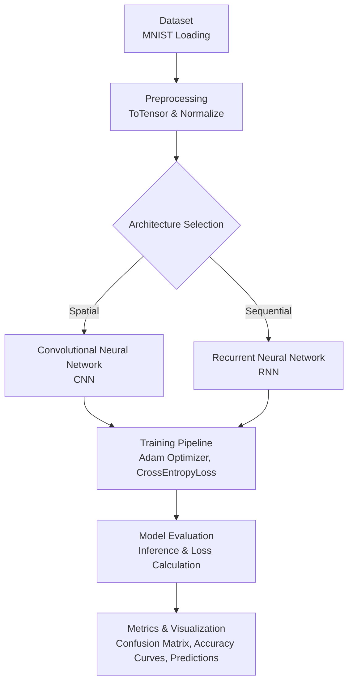

---

## 🧠 Neural Network Architectures

### CNN Architecture
Designed to exploit 2D spatial correlations through convolution and pooling.
- **Block 1:** Conv2D (32 filters, 3x3 kernel, padding=1) ➡️ ReLU ➡️ MaxPool2D (2x2)
- **Block 2:** Conv2D (64 filters, 3x3 kernel, padding=1) ➡️ ReLU ➡️ MaxPool2D (2x2)
- **Classifier:** Flatten (3136 features) ➡️ Linear (128 units) ➡️ ReLU ➡️ Linear Output (10 units)

### RNN Architecture
Designed to process the image sequentially, treating rows as timesteps.
- **Input Dimensions:** 28 timesteps × 28 features (pixels per row)
- **Hidden Layers:** 2 stacked RNN layers (Hidden Size: 128)
- **Sequence Extraction:** Extracts the hidden state of the final (28th) timestep
- **Classifier:** Linear Output (10 units)

---

## 🚀 Training Pipeline

- **Optimizer:** `torch.optim.Adam` (Learning Rate = `0.001`)
- **Loss Function:** `nn.CrossEntropyLoss()`
- **Epochs:** 10
- **Batch Size:** 64
- **Persistence:** Best model weights are automatically saved as `.pth` binaries.

---

## 📈 Evaluation Metrics

The evaluation block automatically generates insights beyond simple accuracy:
1. **Scikit-Learn Classification Report:** Macro and Weighted averages for Precision, Recall, and F1-Score.
2. **Confusion Matrices:** Heatmaps highlighting false positives and edge-case misclassifications.
3. **Computational Latency:** Granular measurement of training completion time and full-set inference speed.

---

## ⚖️ Model Comparison

Below is the empirical benchmark comparing the two distinct architectures, extracted directly from the notebook's generated outputs:

| Metric | CNN | RNN | Verdict |
| :--- | :---: | :---: | :--- |
| **Test Accuracy** | `99.05%` | `96.33%` | 🏆 CNN dominates in spatial recognition. |
| **Test Loss** | `0.0357` | `0.1354` | 🏆 CNN is highly confident on test classifications. |
| **Precision (macro)** | `0.9904` | `0.9631` | 🏆 CNN displays minimal false positive rates. |
| **Recall (macro)** | `0.9905` | `0.9627` | 🏆 CNN maximizes true positive retrieval. |
| **F1 Score (macro)** | `0.9904` | `0.9628` | 🏆 CNN is more robust across all digit classes. |
| **Trainable Parameters** | `421,642` | `54,538` | 🏆 RNN is highly parameter efficient. |
| **Training Time** | `713.68s` | `735.70s` | 🏆 CNN trains faster due to GPU parallelization. |
| **Inference Time** | `18.61s` | `6.44s` | 🏆 RNN shows faster inference on sequential streams. |

### 💡 Key Takeaways
- **CNNs** are the optimal choice for image data. Their shared weights and local receptive fields handle spatial translation invariance elegantly.
- **RNNs** are computationally lighter regarding parameter count (requiring ~87% fewer parameters), but the sequential processing bottleneck (`t` relies on `t-1`) makes training slower and results in lower overall accuracy on spatial visual tasks.

---

## 🖼️ Generated Results

The following plots and charts are generated and saved dynamically during execution.

### Project Pipeline Workflow
Defines the conceptual execution layout and data ingestion lifecycle of the repository.
<p align="center">
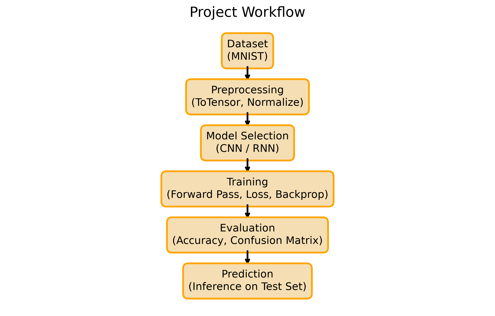
</p>
**Key Observation:** Implementing a clean sequential pipeline guarantees code modifiability and clear isolation of the model architectures from preprocessing stages.

---

### MNIST Dataset Samples
A visualization displaying random digits from the training dataset.
<p align="center">
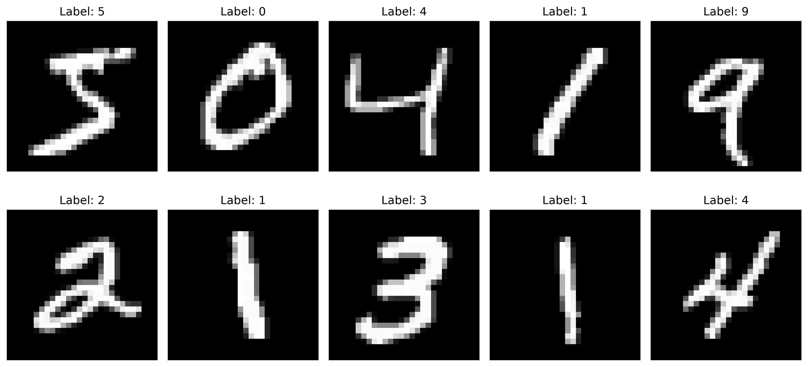
</p>
**Key Observation:** Digits differ significantly in handwriting style, slant, and thickness, representing the underlying variance the architectures must learn.

---

### CNN Layer Architecture
Matplotlib-rendered schematic of the CNN model.
<p align="center">
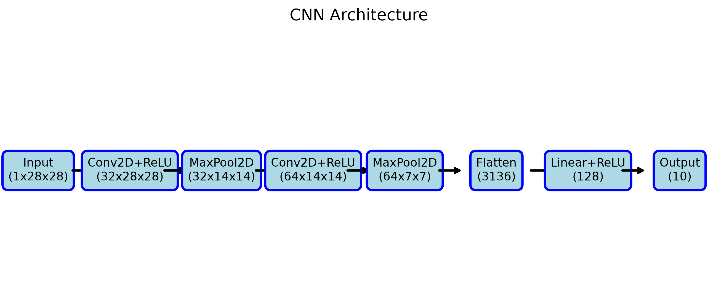
</p>
**Key Observation:** The model utilizes progressive feature extraction, expanding feature maps from 32 to 64 channels while reducing spatial dimensions using pooling layers.

---

### RNN Layer Architecture
Matplotlib-rendered schematic of the RNN model.
<p align="center">
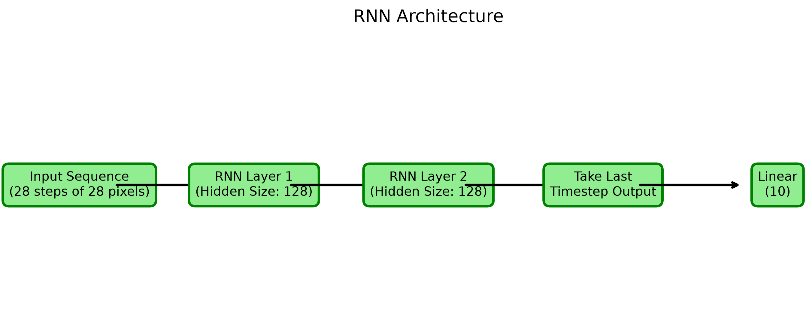
</p>
**Key Observation:** Row-by-row scanning allows the recurrence hidden states to preserve state context until the final output step evaluates the classifications.

---

### CNN Training & Validation Performance
Performance evaluation over 10 training epochs for the CNN model.
<p align="center">
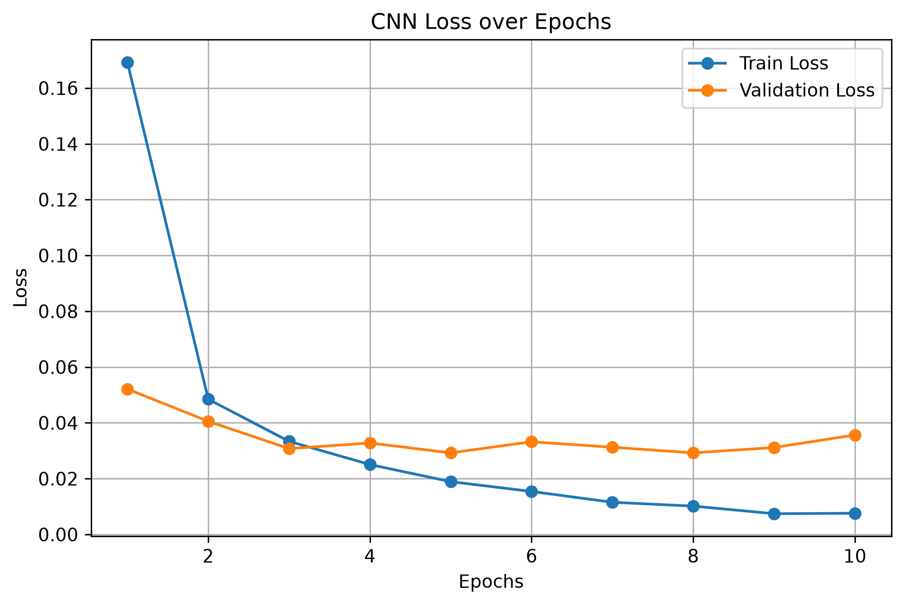
</p>
<p align="center">
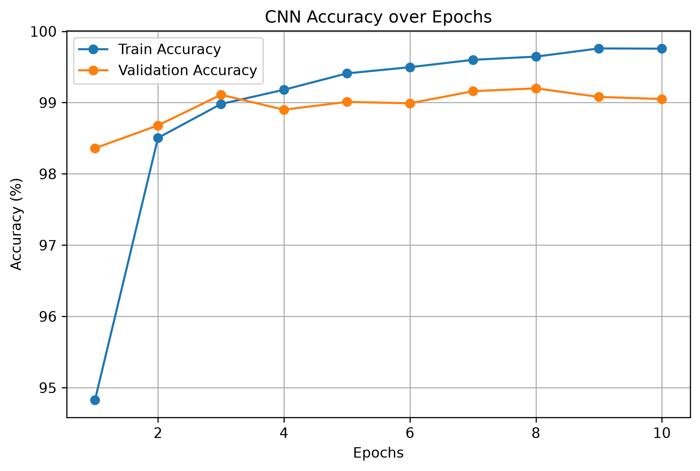
</p>
**Key Observation:** The CNN curves converge rapidly, reaching low validation loss and exceptional classification accuracy early in the training cycles.

---

### RNN Training & Validation Performance
Performance evaluation over 10 training epochs for the RNN model.
<p align="center">
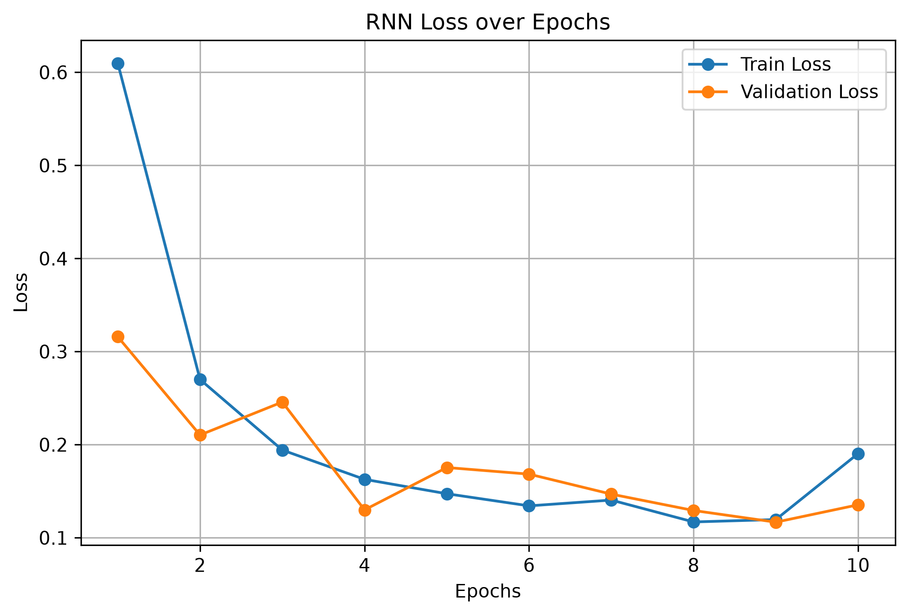
</p>
<p align="center">
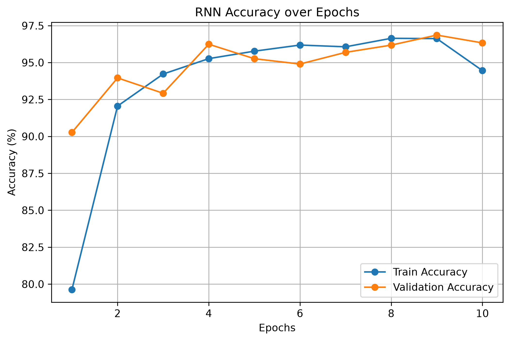
</p>
**Key Observation:** The RNN exhibits higher overall validation loss and a steadier, step-like convergence profile, reflecting the temporal sequence dependency.

---

### CNN Confusion Matrix
Detailed test-set classifications mapping correct targets vs. predictions.
<p align="center">
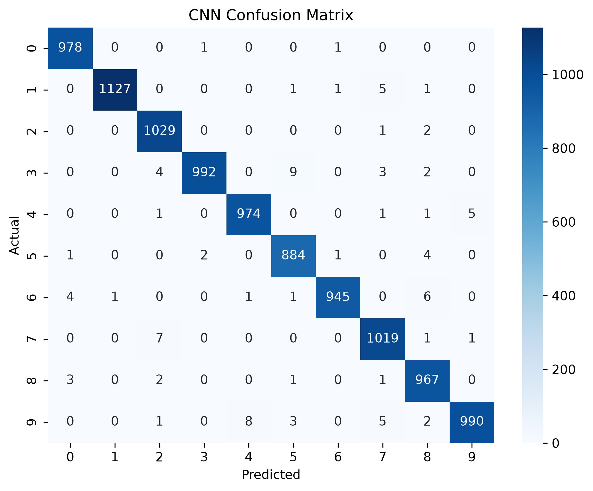
</p>
**Key Observation:** Off-diagonal values are extremely low, showing the CNN excels at distinguishing similar structures (e.g., 4 vs. 9).

---

### RNN Confusion Matrix
Detailed test-set classifications mapping for the sequential network.
<p align="center">
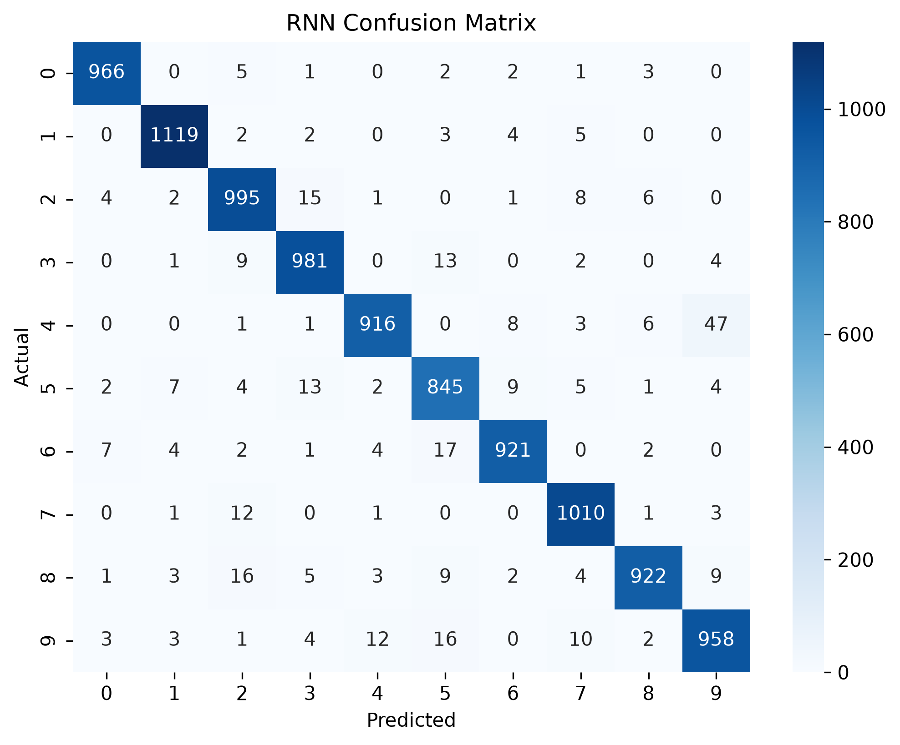
</p>
**Key Observation:** Higher error rates are observed, with misclassifications occurring on structurally similar digits, showcasing the limitation of sequential-based spatial recognition.

---

### Inference Sample Predictions
A visualization showing test predictions made by the trained network.
<p align="center">
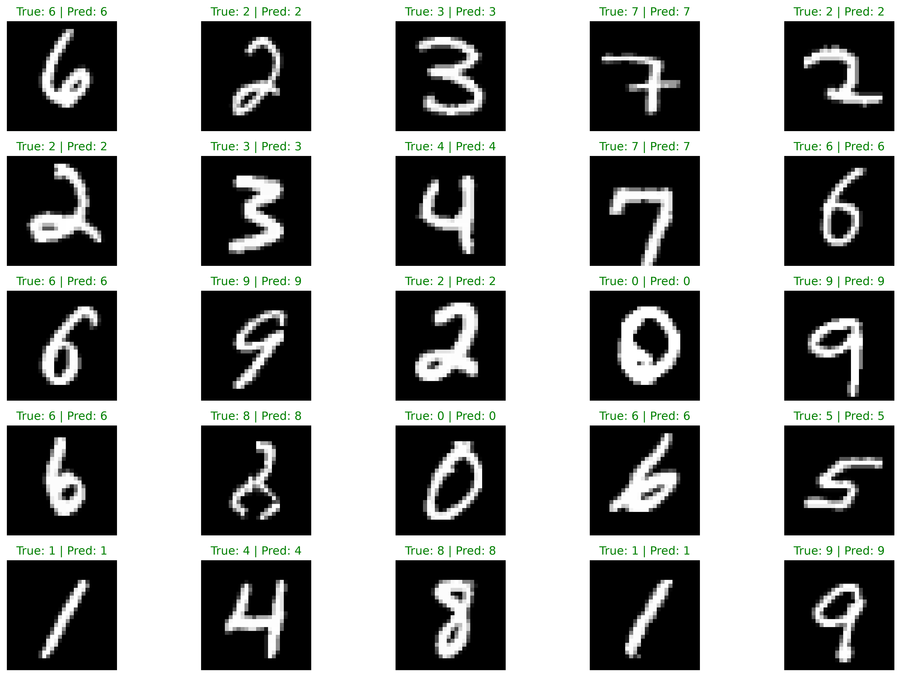
</p>
**Key Observation:** Green text titles highlight successful predictions, illustrating model performance across varied representations of handwritten inputs.

---

### CNN vs RNN Accuracy Comparison
Comparison of the validation accuracies of CNN and RNN.
<p align="center">
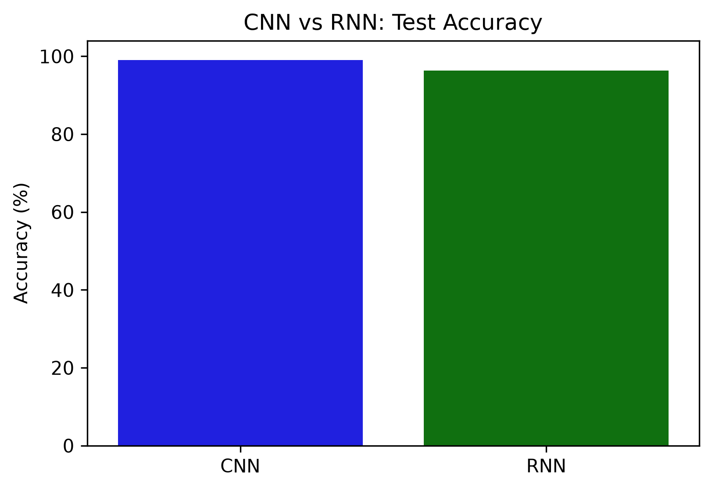
</p>
**Key Observation:** The CNN outperforms the RNN by approximately 2.72% on classification accuracy.

---

### CNN vs RNN Test Loss Comparison
Direct comparison of final test loss values.
<p align="center">
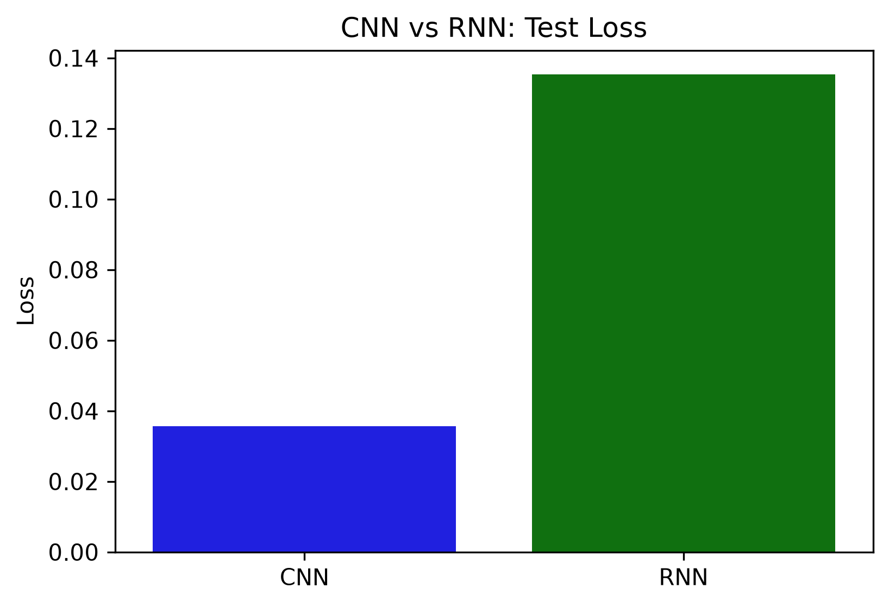
</p>
**Key Observation:** The CNN achieves a lower test loss, reflecting higher statistical confidence in its prediction distributions.

---

### CNN vs RNN Computational Speed
Comparison of training runtime in seconds.
<p align="center">
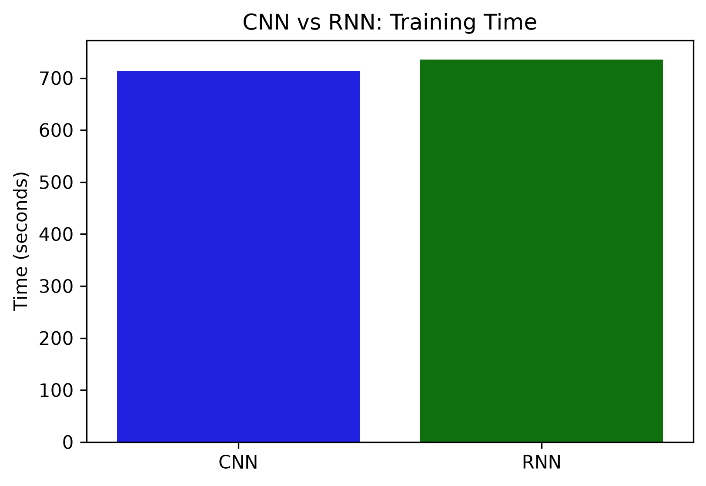
</p>
**Key Observation:** Despite having more parameters, the CNN trains faster than the RNN due to parallel GPU computational pipelines.

---

### Model Performance Metrics Table
Programmatic summary rendering of all comparative stats.
<p align="center">
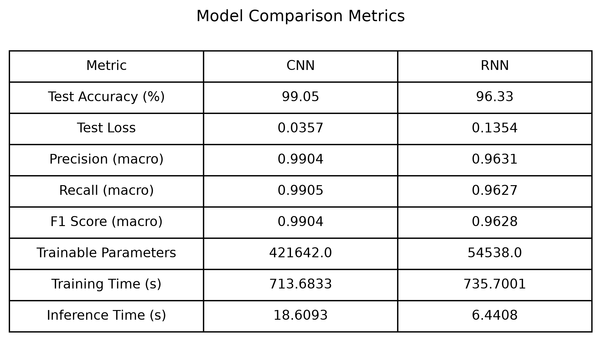
</p>
**Key Observation:** Tabular summaries clearly highlight the trade-off: CNN is superior in visual accuracy and parallel computation speed, whereas RNN is superior in parameter efficiency.

---

## 📂 Repository Structure

```text
MNIST-CNN-vs-RNN-PyTorch/
│
├── README.md                 # Technical documentation & project overview
├── requirements.txt          # Python dependencies & version constraints
├── .gitignore                # Professional Python/PyTorch ignore configuration
├── MNIST_RNN_CNN.ipynb       # Executable Jupyter Notebook
├── build_notebook.py         # Helper script to assemble/update the notebook
│
├── images/                   # 📁 Auto-generated high-res visualizations
│   ├── cnn_accuracy.png
│   ├── cnn_architecture.png
│   ├── cnn_confusion_matrix.png
│   ├── cnn_loss.png
│   ├── cnn_vs_rnn_accuracy.png
│   ├── cnn_vs_rnn_loss.png
│   ├── cnn_vs_rnn_training_time.png
│   ├── dataset_samples.png
│   ├── model_comparison.png
│   ├── prediction_examples.png
│   ├── prediction_examples_rnn.png
│   ├── rnn_accuracy.png
│   ├── rnn_architecture.png
│   ├── rnn_confusion_matrix.png
│   ├── rnn_loss.png
│   └── workflow.png
│
├── outputs/                  # 📁 Auto-generated CSV benchmarking data
│   └── model_comparison.csv
│
└── models/                   # 📁 Auto-generated PyTorch weights (.pth)
```

---

## ⚙️ Installation & Usage

Follow these steps to replicate the environment and execute the project locally.

<details>
<summary><strong>1. Clone the repository</strong></summary>

```bash
git clone https://github.com/skaadil9172/MNIST-CNN-vs-RNN-PyTorch.git
cd MNIST-CNN-vs-RNN-PyTorch
```
</details>

<details>
<summary><strong>2. Setup Virtual Environment</strong></summary>

```bash
# Create the environment
python -m venv venv

# Activate (Windows)
venv\Scripts\activate

# Activate (Mac/Linux)
source venv/bin/activate
```
</details>

<details>
<summary><strong>3. Install Dependencies</strong></summary>

```bash
pip install --upgrade pip
pip install -r requirements.txt
```
</details>

<details>
<summary><strong>4. Launch the Application</strong></summary>

```bash
jupyter notebook
```
*Open `MNIST_RNN_CNN.ipynb` and execute the cells sequentially.*
</details>

---

## 🔮 Future Improvements

This project lays the foundation for robust deep learning experimentation. Future iterations may include:

- **Advanced Architectures:** Implementing **ResNet**, **DenseNet**, or **Vision Transformers (ViT)** for comprehensive benchmarking.
- **Transfer Learning:** Applying pre-trained weights (applicable to more complex datasets like CIFAR-10).
- **MLOps & Tracking:** Replacing static Matplotlib plots with dynamic tracking via **TensorBoard** or **Weights & Biases (WandB)**.
- **Containerization:** Packaging the environment and dependencies into a **Docker** container.
- **Deployment:** Exporting the trained CNN via **ONNX** and deploying a live inference API using **FastAPI** or a front-end interface via **Streamlit**.

---

## 🌍 Real World Applications

The underlying mechanics of this project power enterprise AI systems globally:
- **CNNs** drive facial recognition APIs, medical image diagnostics, object detection in self-driving cars, and satellite imagery analysis.
- **RNNs** are the backbone of sequential models handling stock market time-series forecasting, real-time speech-to-text, and Natural Language Processing (NLP) tasks.

---

## ✍️ Author

**Aadil Shaikh**  
*Senior AI Engineer | Deep Learning Researcher*  
[](https://github.com/skaadil9172)
[](https://linkedin.com/in/your-linkedin-profile)

---
<div align="center">
  <sub>Built with ❤️ using PyTorch. If you found this repository helpful, please consider giving it a ⭐!</sub>
</div>
